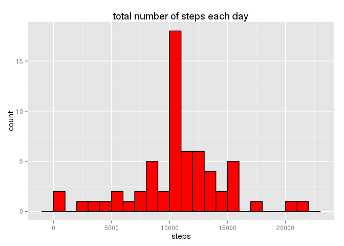
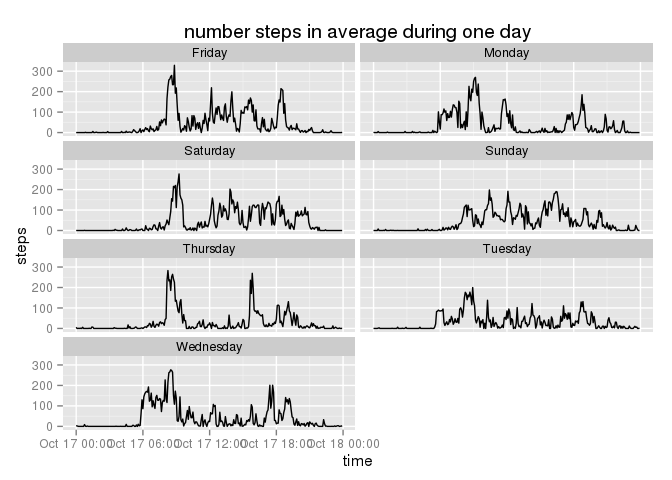

# Reproducible Research: Peer Assessment 1


This document is written in english, therefore we set R to english:

```r
Sys.setlocale("LC_TIME", "en_US")
```

```
## [1] "en_US"
```

## Loading and preprocessing the data

We start by unzipping an loading the data:

```r
unzip("activity.zip")
data <- read.csv("activity.csv")
```

We create a new column with a date-time value. Also, we transform the column date to be a proper date column:

```r
data$time <- strptime(sprintf("%s %.4d", data$date, data$interval), format = '%Y-%m-%d %H%M' )
data$date <- strftime(data$date, format = '%Y-%m-%d')
```

We check the result:

```r
str(data)
```

```
## 'data.frame':	17568 obs. of  4 variables:
##  $ steps   : int  NA NA NA NA NA NA NA NA NA NA ...
##  $ date    : chr  "2012-10-01" "2012-10-01" "2012-10-01" "2012-10-01" ...
##  $ interval: int  0 5 10 15 20 25 30 35 40 45 ...
##  $ time    : POSIXlt, format: "2012-10-01 00:00:00" "2012-10-01 00:05:00" ...
```

In a first step we rather ignore missing values, as we can see there are several missing values in the variable *steps*:

```r
missingValues <- is.na(data$steps)
missingValuesAmount <- sum(missingValues)
```
which corresponds to 13.1148% of the measurements.

On the other hand, all dates exists as we can see by the absence of **NA**s on the variable *time*:

```r
sum(is.na(data$time))
```

```
## [1] 0
```

## What is mean total number of steps taken per day?

Let us get the subset of well formed data (without **NA**s):

```r
dataWithoutNA <- data[!missingValues,]
```

Check it:

```r
str(dataWithoutNA)
```

```
## 'data.frame':	15264 obs. of  4 variables:
##  $ steps   : int  0 0 0 0 0 0 0 0 0 0 ...
##  $ date    : chr  "2012-10-02" "2012-10-02" "2012-10-02" "2012-10-02" ...
##  $ interval: int  0 5 10 15 20 25 30 35 40 45 ...
##  $ time    : POSIXlt, format: "2012-10-02 00:00:00" "2012-10-02 00:05:00" ...
```

Compute the sum:

```r
dataWithoutNAsum <- aggregate(dataWithoutNA$steps, list(dataWithoutNA$date), sum)
colnames(dataWithoutNAsum) <- c("date", "steps")
```


```r
library(ggplot2)
print(ggplot(dataWithoutNAsum, aes(steps)) + ggtitle("total number of steps each day") + geom_histogram(binwidth = 1000, colour = "black", fill = "red"))
```

 


```r
dataWithoutNAmean <- mean(dataWithoutNAsum$steps)
dataWithoutNAmedian <- median(dataWithoutNAsum$steps)
```
Which corresponds to a average of 1.0766 &times; 10<sup>4</sup> and a median of 10765.
Notice that the average and the median are surprisingly close to each other.
This means that the left tail is similar to the right tail.

### Distribution of the missing values

Notice that during a day there are $24 \times 60 / 5$ intervals, *i.e.* 288 intervals. Let us count the numbers of missing values per day:


```r
missingValuesPerDay <- aggregate(missingValues, list(data$date), sum)
colnames(missingValuesPerDay) <- c("date", "steps")
subset(missingValuesPerDay, missingValuesPerDay$steps != 0)
```

```
##          date steps
## 1  2012-10-01   288
## 8  2012-10-08   288
## 32 2012-11-01   288
## 35 2012-11-04   288
## 40 2012-11-09   288
## 41 2012-11-10   288
## 45 2012-11-14   288
## 61 2012-11-30   288
```

So we conclude that it is all or nothing, *i.e.* we have 0 or 288 measurements per day. We can find no pattern at all on the missing days.

### Distributions of zeros

Let us digress a little bit about the intervals without any step:


```r
zeroLocation <- (dataWithoutNA$steps == 0)
zeroCount <- aggregate(zeroLocation, list(dataWithoutNA$date), sum)
colnames(zeroCount) <- c("date", "count")
summary(zeroCount$count)
```

```
##    Min. 1st Qu.  Median    Mean 3rd Qu.    Max. 
##     173     195     204     208     214     286
```

We can see that most of the time the subject of the study was not *moving*.

## What is the average daily activity pattern?

Perhaps more interesting is to study if there is some daily pattern.
For that purpose let us aggregate the results per time:


```r
dailyData <- aggregate(dataWithoutNA$steps, list(dataWithoutNA$interval), mean)
colnames(dailyData) <- c("interval", "steps")
str(dailyData)
```

```
## 'data.frame':	288 obs. of  2 variables:
##  $ interval: int  0 5 10 15 20 25 30 35 40 45 ...
##  $ steps   : num  1.717 0.3396 0.1321 0.1509 0.0755 ...
```

Create a new column with a time variable:

```r
dailyData$time <- strptime(sprintf("%.4d", dailyData$interval), format = '%H%M')
```

We can plot the results:

```r
print(ggplot(dailyData, aes(x = time, y = steps))+ ggtitle("number steps in average during one day") + geom_line())
```

 

We can see several picks during the day, and a very flat graph during the night (which is not surprising). 
The maximum of the graph can be computed by:

```r
max <- max(dailyData$steps)
maxTime <- dailyData[dailyData$steps == max, "time"]
```
*I.e.* the maximum is reached at 08:35 and its value is 206.1698 steps.

## Imputing missing values

As we saw there are exacly 8 days without data, which corresponds to 13.1148% of the time. The fact that there are whole days missing implies that we have no information at all about those days.

In order to fill the gaps, we adopt the strategy: **replace missing data at time t by the average steps at time t in other days**.

We get the data wich is missing, *i.e.* only dates and times:

```r
dataNA <- subset(data, select = c("date", "interval", "time"), missingValues)
```

And replace **NA** values by the mean:

```r
replacedData <- merge(dataNA, subset(dailyData, select = c("steps", "interval")))
wholeData <- rbind(replacedData, dataWithoutNA)
```

And check the result:

```r
str(wholeData)
```

```
## 'data.frame':	17568 obs. of  4 variables:
##  $ interval: int  0 0 0 0 0 0 0 0 5 5 ...
##  $ date    : chr  "2012-10-01" "2012-11-30" "2012-11-04" "2012-11-09" ...
##  $ time    : POSIXlt, format: "2012-10-01 00:00:00" "2012-11-30 00:00:00" ...
##  $ steps   : num  1.72 1.72 1.72 1.72 1.72 ...
```

### Steps per day

Compute the sum:

```r
dataSum <- aggregate(wholeData$steps, list(wholeData$date), sum)
colnames(dataSum) <- c("date", "steps")
```


```r
print(ggplot(dataSum, aes(steps))+ ggtitle("total number of steps each day") + geom_histogram(binwidth = 1000, colour = "black", fill = "red"))
```

 


```r
dataMean <- mean(dataSum$steps)
dataMedian <- median(dataSum$steps)
```
Which corresponds to a average of 1.0766 &times; 10<sup>4</sup> and a median of 1.0766 &times; 10<sup>4</sup>.

Of course, the fact that we are adding an some *average* days, it rises the center bar, keeping all the others at the same level.
In fact, the way we are inputing simulated data *erases* the differences which is not what we want.
For this reason, in what follows we will not use this simulated data.

## Are there differences in activity patterns between weekdays and weekends?

Let us add two new columns with the week day and a boolean variable indicating if it is weekend or not:

```r
dataWithoutNA$weekday <- factor(weekdays(dataWithoutNA$time))
dataWithoutNA$weekend <- factor(ifelse (dataWithoutNA$weekday == "Sunday" | dataWithoutNA$weekday == "Saturday", "weekend", "weekday"))
```

Check the results:

```r
summary(subset(dataWithoutNA, select = c("weekday", "weekend")))
```

```
##       weekday        weekend     
##  Friday   :2016   weekday:11232  
##  Monday   :2016   weekend: 4032  
##  Saturday :2016                  
##  Sunday   :2016                  
##  Thursday :2304                  
##  Tuesday  :2592                  
##  Wednesday:2304
```

### The results depoending if it is weekend

We start by averaging per time of the day, but splitting in two cases: weekday and weekend:


```r
dailyDataWeekend <- aggregate(dataWithoutNA$steps, list(dataWithoutNA$interval, dataWithoutNA$weekend), mean)
colnames(dailyDataWeekend) <- c("interval", "weekend", "steps")
str(dailyDataWeekend)
```

```
## 'data.frame':	576 obs. of  3 variables:
##  $ interval: int  0 5 10 15 20 25 30 35 40 45 ...
##  $ weekend : Factor w/ 2 levels "weekday","weekend": 1 1 1 1 1 1 1 1 1 1 ...
##  $ steps   : num  2.333 0.462 0.179 0.205 0.103 ...
```


Create a new column with a time variable:

```r
dailyDataWeekend$time <- strptime(sprintf("%.4d", dailyDataWeekend$interval), format = '%H%M')
```

Now we can do both plots:

```r
print(ggplot(dailyDataWeekend, aes(x = time, y = steps, group = weekend)) + ggtitle("number steps in average during one day") + facet_wrap(~weekend, ncol = 1) + geom_line())
```

 

Notice that at the weekend the steps start later on the day and they are more spread during the day. This compare to the big pick in the morning during the weekdays.

### The results depoending in the weekday

Even if it is not asked, we can not avoid the question is there any difference between all weekdays? Is that classification of *weekend* or *weekday* enough?

Let us average the number of steps per time of the day splitting according to the day:


```r
dailyDataWeekday <- aggregate(dataWithoutNA$steps, list(dataWithoutNA$interval, dataWithoutNA$weekday), mean)
colnames(dailyDataWeekday) <- c("interval", "weekday", "steps")
str(dailyDataWeekday)
```

```
## 'data.frame':	2016 obs. of  3 variables:
##  $ interval: int  0 5 10 15 20 25 30 35 40 45 ...
##  $ weekday : Factor w/ 7 levels "Friday","Monday",..: 1 1 1 1 1 1 1 1 1 1 ...
##  $ steps   : num  0 0 0 0 0 0 0 0 0 0 ...
```


Create a new column with a time variable:

```r
dailyDataWeekday$time <- strptime(sprintf("%.4d", dailyDataWeekday$interval), format = '%H%M')
```

Now we can do two plots. If it is weekend:


```r
print(ggplot(dailyDataWeekday, aes(x = time, y = steps, group = weekday)) + ggtitle("number steps in average during one day") + facet_wrap(~weekday, ncol = 2) + geom_line())
```

 

The results are not completely regular, we can see that saturday and sunday are quite different.
Also that monday, tuesday and wednesday there is a secondary pick before 8 am.


## Final remarks

Also, on the one hand we do not know the subject which will be important to understand the picks, on the other hand it will be interesting to have the same data for some large group of people.

Also, in order to be a reasonable research work we would need to compute the standart deviation corresponding to each average taken.

Even if it was explicitly asked to use the simulated data, I refuse to use it. As I do not see the interest of it. In fact in the best case scenario it makes no difference. Worst, if we use the method used here, this will average the results erasing the differences, which is far from what we want.
